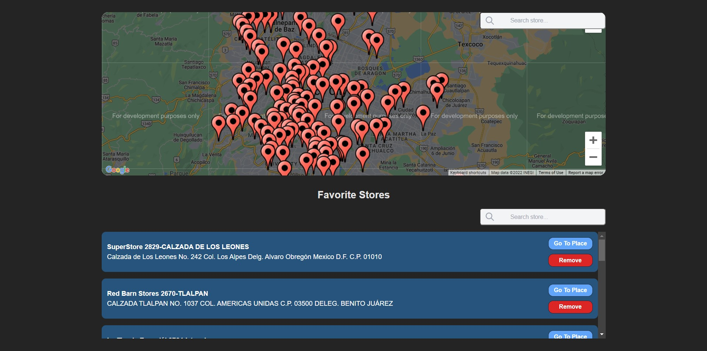

## Generation - Google Maps

Code-Challenge realizado por parte el programa de Generation

Tecnologias utilizadas: [React + Typescript]

<code></code>
<code></code>

### Historias de usuario
- As a student, I want to see a map of Mexico City
- As a student, I want to see a map that has all the stores represented as markers/pins on the map.
- As a student, I want to be able to click on a store and add it to a list of 'My Favorite Stores'.

### Preview


### Uso
Este proyecto es totalmente libre, para ejecutarlo realiza un clone de este repositorio y agrega tu API KEY en la siguiente variable de entorno
```ts
// .env.template
GOOGLE_MAPS_API_KEY=
```